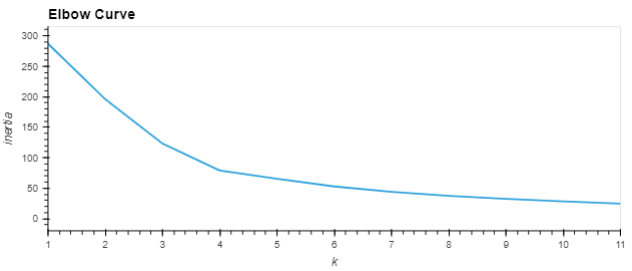
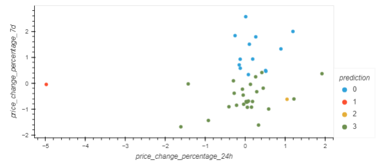
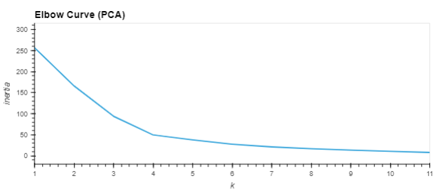
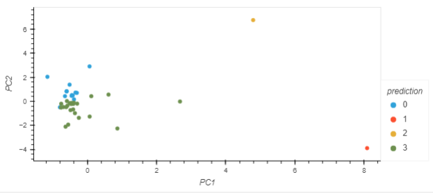

# Crypto Clustering Challenge

## Introduction

For this challenge we scaled down our data to prepare it, then used Kmeans to obtain a prediction of clustering according to 7 features for each datapoint. After that, to compare, we used PCA (Principal component analysis) and repeated the process to group the same data points.  

## Results

### Original 
  
_Elbow curve for original data: The optimal value for k is 4._  
  
_Clustering for original data: The data has some overlap, like category 2 (yellow) and 3 (green)._
___

### Principal component analysis
  
_Elbow curve for original data: The optimal value for k is still 4._
  
_Clustering for PCA: The data has less overlap, numbers are closer to each other and further from the other categories._  
